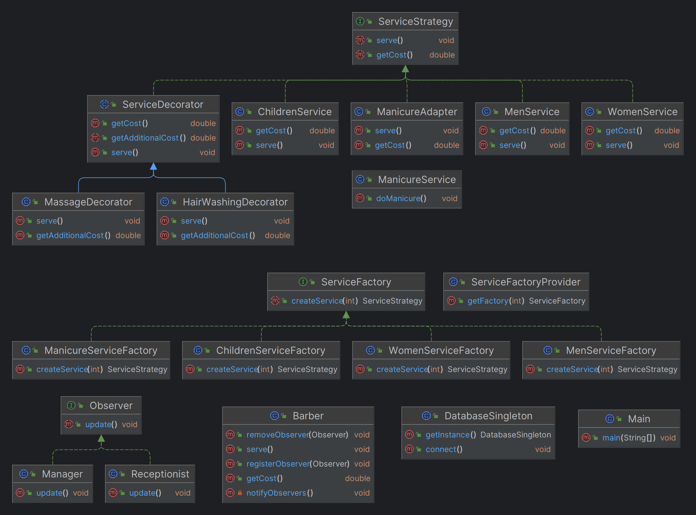

# Barbershop Environment Modeling System

**Project Name:** Barbershop Modeling System  
**Group:** SE-2210  
**Student:** Kaskyrbayev Mukhammed
## Table of Contents

- [Project Overview](project-overview)
- [Design Patterns](#design-patterns)
  - [Strategy Pattern](#strategy-pattern)
  - [Singleton Pattern](#singleton-pattern)
  - [Factory Pattern](#factory-pattern)
  - [Decorator Pattern](#decorator-pattern)
  - [Observer Pattern](#observer-pattern)
  - [Adapter Pattern](#adapter-pattern)
- [Conclusion](#conclusion)

## Project Overview

### Description

This project is a comprehensive and adaptable system designed for managing services in a barbershop. By incorporating various design patterns and adhering to SOLID principles, the goal is to create a maintainable and extensible codebase.

### Idea of the Project

The primary concept revolves around modeling a virtual barbershop environment, where customers can seamlessly select from an array of stylist services. The system accommodates diverse services such as men's haircuts, women's haircuts, children's haircuts, and manicures. Additionally, customers have the option to include extra services like hair washing and massages.

### Purpose of the Project

The project serves as a showcase of design patterns, including Singleton, Strategy, Observer, Factory, Decorator, and Adapter. The adherence to SOLID principles ensures a robust and logically structured system.

## Main Body

## Design Patterns
### Strategy Pattern

The **Strategy pattern** is employed to model various barbershop services (Men's Haircut, Women's Haircut, Manicure) as separate strategies, implementing the `ServiceStrategy` interface.

### Singleton Pattern

The **Singleton pattern** is employed for managing the database connection. This ensures a single and globally accessible instance of the database connection, enhancing efficiency and avoiding redundant database connections.

### Factory Pattern

The **Factory pattern** is implemented to create services dynamically based on user choices. The `ServiceFactoryProvider` selects the appropriate factory, and the chosen factory creates the specific service. This allows for flexible service creation.

### Decorator Pattern

The **Decorator pattern** enhances customization by allowing customers to add additional features to their chosen services. For example, customers can choose features like `HairWashing` or `Massage`, which are implemented as decorators.

### Observer Pattern

Real-time updates are achieved using the **Observer pattern**. The `Manager` and `Receptionist` are notified instantly when a service is done, enabling quick actions or immediate sharing of information.

### Adapter Pattern

The **Adapter pattern** is used to make non-standard services, such as `Manicure`, fit the standard `ServiceStrategy` interface. This guarantees a uniform interface for all services and ensures easy integration.

## Conclusion

In this project, I used design patterns like **Singleton, Strategy, Observer, Factory, Decorator, and Adapter** to make a flexible system for a barbershop. It's good at handling different services and notifying people when a service is done. I followed some **SOLID, DRY, KISS, YAGNI** principles for better code. I learned some things along the way, and this project can be improved by adding more services, more specific and concrete method implementations, making sure it works well in different situations.
